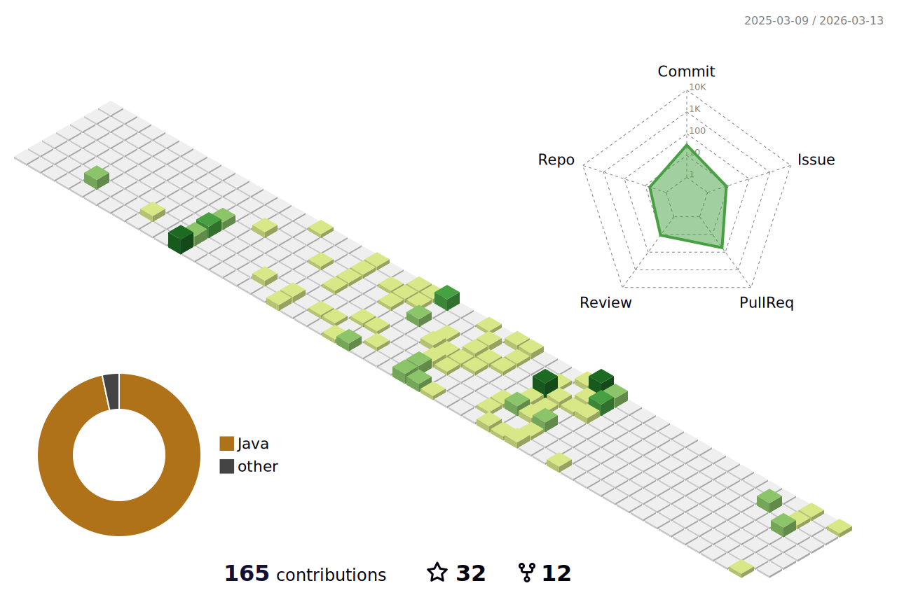

### Hi Fellow Devs :wave:

I'm Wen Wu(文武). A Java Developer and Open Source Enthusiast from ChangSha (China)🇨🇳.

#### 📈 Github Stats
|  |  |
| ------------- | ------------- |

**languages and tools:**  

<!--
<code></code>
<code></code>
<code></code>
<code></code>
<code></code>
<code></code>
-->

#### 🏆 GitHub Trophies

#### Top Repositories

 
 

<!--
**wuwen5/wuwen5** is a ✨ _special_ ✨ repository because its `README.md` (this file) appears on your GitHub profile.

Here are some ideas to get you started:

- 🔭 I’m currently working on ...
- 🌱 I’m currently learning ...
- 👯 I’m looking to collaborate on ...
- 🤔 I’m looking for help with ...
- 💬 Ask me about ...
- 📫 How to reach me: ...
- 😄 Pronouns: ...
- ⚡ Fun fact: ...
-->
